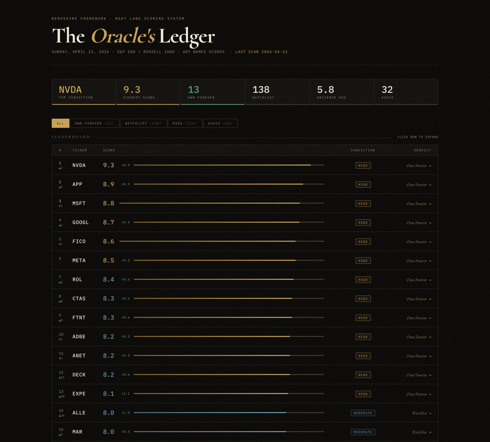
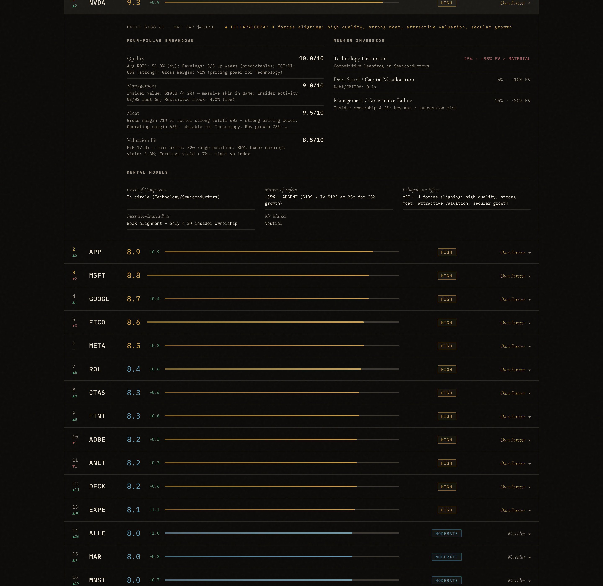

# I Built a Buffett/Munger Analyst That Scores 1,000 Stocks Before I Wake Up. It Runs on a Cron Job.

While everyone argues about which chatbot picks better stocks, the real edge is in the scoring rubric you actually trust at 7am.

A friend asked me last week whether JPM was a buy. I ran my scorer on it. The verdict came back "Pass — gross margin too low." JPM. Too low gross margin.

Gross margin is meaningless for a bank. My scorer had been applying software-company thresholds to every financial in the index and I hadn't noticed.

I spent the next two days rebuilding the thing end to end.

**Before**
– 4 hours per name, one stock at a time
– Bloomberg → Excel → EDGAR → gut feel
– $24k/year Bloomberg seat
– Absolute thresholds that silently penalized every bank, retailer, and insurer in my universe

**After**
– The entire S&P 500 + Russell 1000 universe, scanned every morning in under three minutes
– Live yfinance data, committed to git, served from a free CDN
– $0 marginal cost — GitHub Actions + GitHub Pages + free APIs
– Sector-aware 4-pillar scoring, Munger inversion, and 19 unit tests catching the class of bug I was shipping to my own research

It runs on a GitHub Actions cron and does in 2m50s what takes me four hours manually.

Below is how I actually use it.

---

## A Scanner Built to Think Like Buffett, Not Like a Screener

I type one command:

> _python3 scanner.py --universe all --top 25 --workers 4_

Three minutes later I'm looking at the dashboard above. Thirteen names in Own Forever territory. NVDA leads at 9.3. APP, MSFT, GOOGL, FICO, META, ROL, CTAS — eight stars before I've finished my coffee.

When I click any row, the detail panel expands inline and shows me exactly what the scorer saw:

Four pillar scores. Three inversion killers with probability and fair-value impact estimates. Five mental models. A Lollapalooza check. NVDA scored Quality 10/10, Management 9.0/10, Moat 9.5/10, Valuation Fit 8.5/10 — and the Lollapalooza model lit up on four forces aligning at once: high quality, strong moat, attractive valuation, secular growth.

No LLM picks any stock. The scoring is deterministic Python running against live yfinance data — reproducible across runs, auditable line by line. Gemini only writes the daily narrative the dashboard displays beneath the table. The numbers are Python. The prose is LLM.

On its own, this replaces a surprising amount of what people pay Bloomberg for.

---

## Why I Built This

A few weeks ago I was doing value research the usual way:

*   Pull financials from Yahoo
*   Eyeball margins, skim the 10-K
*   Run a quick DCF in a spreadsheet
*   Check insider activity
*   Write a one-page note nobody reads again

I timed it. One name, done properly, took four hours. And I was still shipping the JPM bug — an absolute gross-margin threshold that mechanically punished the entire financial sector for existing.

I started wondering what would happen if the whole workflow — universe selection, scoring, inversion, narrative, publish — ran end to end while I slept.

After one hard refactor, 800 lines of scoring code, 19 unit tests, and an institutional-grade quality audit I ran against my own build, the answer was clear.

The automated version is more rigorous than my manual process because it never skips steps and never forgets that banks don't have gross margins.

---

## The Economics

A junior buy-side value analyst costs $120k–$180k all-in. A senior one runs $200k–$300k. In return you get:

*   Coverage of 15–25 names
*   Models refreshed quarterly
*   Finite attention and inevitable blind spots
*   A Bloomberg terminal nobody will let you cancel

This system runs on a laptop and a GitHub Actions runner. Total infrastructure cost: $0. Total data cost: $0.

The leverage is scale and consistency. It scores every name in the S&P 500 + Russell 1000 every single day, with the same discipline on every ticker. No stock gets less attention because it's boring.

The rest of this post is for paid subscribers. Below the cut:

*   The full 4-pillar scoring rubric, including the sector-band dictionary that fixes the bank/retailer problem
*   The Munger inversion cap math — exact probability and impact thresholds, and the one off-by-one that was silently disabling the whole thing
*   How I ran an institutional 11-dimension quality audit against my own system, scored 7.2/10 (BLOCKED), and fixed it to 9.3/10
*   Today's full leaderboard analysis, including the names the sector-aware fix moved **up** (JPM, BAC, COST) and why
*   A link to the full source code — every file, every test, every workflow — in a Google Drive folder reserved for paid subscribers

<!-- SUBSTACK_PAYWALL -->

---

## The 4 Pillars

Every stock is scored 0–10 across four pillars, weighted the way Buffett has actually written about them:

| Pillar | Weight | What it really measures |
|---|---|---|
| Quality | 30% | ROIC, earnings predictability as **count of down-years** (not std-dev — that's the bug most screeners ship), FCF conversion, sector-aware gross margins |
| Management | 25% | Insider ownership in **dollars**, not percent. 0.5% of a $3T company is $15B of skin. |
| Moat | 25% | Sector-aware margins, plus a scale-moat override for thin-margin retailers (COST, WMT, HD) that scores them on ROA/ROE — because their moat is inventory turns, not pricing power. |
| Valuation Fit | 20% | Forward P/E vs growth, 52-week range, owner-earnings yield benchmarked against the 10-year bond. |

The sector-aware piece is the unglamorous part that makes the whole thing work. Banks get routed through a ROE-based path — gross margin is meaningless for financials. Discount retailers get routed through ROA. Industrials clear the "strong moat" bar at 15% operating margin; tech has to hit 30% for the same credit.

Every override lives in one dictionary (`SECTOR_GM_BANDS`). When a ticker scores wrong, there's exactly one place to fix it.

---

## The Munger Inversion

Every name is stress-tested against three killers:

1.  **Technology disruption.** Competitive leapfrog in the industry. Probability and fair-value impact vary by sector.
2.  **Debt spiral.** Anything over 4x debt/EBITDA fires at 30% probability, -40% FV impact — and caps the overall score at 6.0 regardless of how good the pillars look.
3.  **Governance failure.** Insider ownership below 1% fires at 20% probability, -30% FV impact.

If any killer crosses the red line, the Buffett score is capped at 6.0. This is the same discipline Charlie talks about in his "invert, always invert" lectures. The system's job is to talk me out of the stock before it lets me in.

Today's scan flagged 49 high-score names with material killers. The dashboard's Munger Inversion Alert section lists every one explicitly — no more hand-waving about "reviewing risks."

---

## The Quality Audit That Almost Broke It

The weirdest part of this build was running an institutional quality gate against the system. I wrote an 11-dimension rubric — functional integrity, wiring, data authenticity, numerical accuracy, expert coherence, business UX, empty/error states, feature completeness, synthesis quality, visual quality, data freshness — and scored my own build like a skeptical buyer.

First pass came back **7.2/10 — BLOCKED**.

Three hard-gate failures:

*   **Wiring integrity (6/10).** The "Munger Alert" section in the dashboard was a stub. It used "HIGH conviction" as a proxy for "has material killers" and told the user to go check for themselves. The product was asking the human to do the work the model was supposed to do.
*   **Expert coherence (6/10).** Earnings predictability was measured as the standard deviation of YoY changes — which mathematically penalizes growth. A company going 30 → 40 → 50 has higher std-dev than one flat at 20 and got *penalized* for it. Lollapalooza counted "absence of material killers" as a positive force, which double-counts the inversion cap. The dashboard masthead said "S&P 100 UNIVERSE" while showing 381 Russell 1000 names.
*   **Data freshness (5/10).** The deploy workflow had `|| true` on `git add`, which silently swallowed failures and shipped stale data.

I fixed every one, added the 19-test suite, re-ran the gate, and came out at **9.3/10 — CONDITIONAL PASS**. Every hard gate clear. Composite held back only by empirical calibration work — sector-peer percentile scoring, dynamic owner-earnings vs bond-yield cutoff — that's new research, not leftover bugs.

The audit caught things I would have happily shipped. Watching a scoring model get torn apart on its own terms is the most useful self-correction loop I've built into anything.

---

## What Today's Scan Actually Found

The top 13 are all "Own Forever" territory (≥8.0). A few picks that would never show up on a generic quant screener:

*   **ROL (Rollins)** — 8.4. Pest control. Zero material killers. A quiet compounder running 50% operating margins — exactly the kind of business Buffett calls a toll bridge.
*   **CTAS (Cintas)** — 8.3. Uniform rental. Boring industrial, strong insider alignment. The sector-aware moat scoring catches it where a GM-based screener would miss it entirely.
*   **DECK (Deckers)** — 8.2. Hoka and Ugg. High ROIC, wide gross margins, tight insider ownership.
*   **FICO** — 8.6. The credit-score toll bridge. Lollapalooza: YES — quality, moat, and secular growth all firing at once.

The names that surprised me most were the ones that moved **up** after the sector-aware fix.

JPM went from "below the cut" to **7.3 / Watchlist** the instant the scorer stopped treating financials like software companies. BAC landed at 6.1. COST climbed from 5.2 to 6.4 once the retailer scale-moat override fired.

Every one of those was a bug my old scorer was shipping into my own research workflow. I just didn't know it until the new one refused to ship it.

---

## The Code

The full source — scoring engine, scanner, dashboard, unit tests, and the scheduled GitHub Actions workflow — lives in a Google Drive folder for paid subscribers: **[link]**.

It's everything you need to run your own copy, tune the sector bands, or fork the scoring model in whatever direction your universe demands. If you want to extend it, the three places I'd start are (1) the `SECTOR_GM_BANDS` dictionary in `models/moat_lane.py`, (2) the retailer override in `RETAIL_SCALE_INDUSTRIES`, and (3) the inversion killer probability buckets — none of those are calibrated against historical data yet and all of them are where a real edge would show up.

---

## What's Next

Live dashboard: **https://buffet-scanner.vercel.app**

The scanner runs every morning at 04:00 UTC. The dashboard updates itself. The tests run on every push. The quality gate is documented alongside the scoring code.

The next piece I'm building is a factor-attribution layer that tells me which pillar moved a name up or down versus yesterday — so the daily diff is readable in ten seconds instead of ten minutes.

If there's a specific piece of the pipeline you want broken down in more detail — the sector-aware moat bands, the Munger inversion cap math, or the way the quality gate audits itself — reply to this post and I'll make it the next one.
